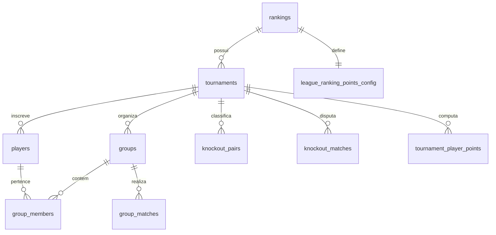
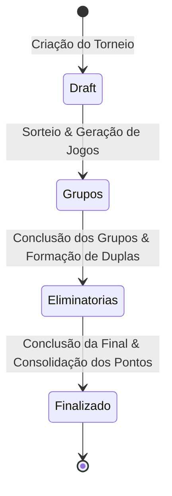

# PRD — Liga Jurerê Beach Sports (Beach Tennis Tournament Manager)

> **Versão:** 1.0.0  
> **Status:** Aprovado / Em Produção  
> **Última Atualização:** Setembro de 2026  
> **Repositório:** `betterikeproject-a11y/beach-tennis-app`  
> **Propósito:** Documento de Requisitos de Produto (PRD) e especificação técnica definitiva para padronização e evolução da plataforma.

---

## 1. Visão Geral e Contexto do Produto

### 1.1 Objetivo do Sistema
A plataforma **Liga Jurerê Beach Sports** é uma aplicação web especializada no gerenciamento integral de torneios de Beach Tennis disputados no formato **Rei da Praia / Super 8 com Duplas Rotativas** (*Rotating Doubles*), além da consolidação de pontuações em rankings contínuos da liga (categorias Masculino B/C, Feminino, Geral, etc.).

### 1.2 Problema que Resolve
Torneios de Beach Tennis no formato Super 8 / Rei da Praia tradicionalmente dependem de pranchetas de papel ou planilhas manuais propensas a falhas graves:
- Erros de rotação de parceiros (jogadores repetindo parceiros na fase de grupos).
- Cálculos manuais incorretos de saldo de games e critérios de desempate sob pressão.
- Incerteza e atrasos no chaveamento do mata-mata (cálculo de mérito geral e byes).
- Ausência de visibilidade em tempo real para os atletas e público presente no clube.
- Dificuldade em manter um ranking acumulado unificado da liga ao longo das etapas.

### 1.3 Proposta de Valor
- **Automação Matemática Rigorosa**: Sorteio balanceado com algoritmo de distribuição de grupos (4 ou 5 atletas), matriz matemática perfeita de rotação de parceiros e chaveamento de eliminatórias com byes automáticos.
- **Transmissão e Atualização em Tempo Real**: Atualizações instantâneas de placares via Supabase Realtime (CDC) na quadra sem necessidade de recarregar a página.
- **Validação de Regras Oficiais de Beach Tennis**: Bloqueio de placares de set ilegais diretamente na interface de lançamento.
- **Consolidação de Ranking da Liga**: Agregação de pontos de múltiplos torneios com normalização inteligente de nomes e tabela de pontuação personalizável por ranking.

---

## 2. Personas e Matriz de Permissões (RBAC)

O sistema adota um modelo de permissão híbrido e pragmático, otimizado para operação rápida no ambiente de quadra:

| Persona | Perfil | Método de Acesso | Responsabilidades & Ações Permitidas |
|---|---|---|---|
| **Administrador / Organizador** | Organizador do torneio, juiz de quadra, comissão técnica. | Senha mestra (`admin_token` via cookie seguro HTTP-only). | • Criar, arquivar e excluir categorias/rankings.<br>• Criar novo torneio e cadastrar atletas (com definição de cabeças de chave).<br>• Realizar sorteio automático ou manual de grupos.<br>• Lançar e alterar placares da fase de grupos e eliminatórias.<br>• Aplicar desempate manual (`position_override`) em empates triplos.<br>• Montar chaves de eliminatórias e definir avanços.<br>• Editar grafia de nomes de atletas com propagação de histórico.<br>• Finalizar e re-finalizar torneios, computando pontos da liga.<br>• Configurar tabela de pontuação por ranking. |
| **Jogador / Espectador** | Atletas participantes, torcida, familiares e sócios do clube. | Público (sem login / URL direta). | • Visualizar lista de torneios e rankings acumulados da liga.<br>• Acessar tela de transmissão ao vivo (`/visualizacao`) em tempo real.<br>• Consultar classificação dos grupos e confrontos pendentes/finalizados.<br>• Acompanhar árvore de eliminatórias (bracket) e pódio. |

---

## 3. Arquitetura da Solução & Stack Tecnológico

```
┌────────────────────────────────────────────────────────────────────────┐
│                          CLIENT LAYER                                  │
│  Next.js 16 (App Router) + React 19 + Tailwind CSS v4 + shadcn/ui      │
│  - / (Home & Liga Ranking)                                             │
│  - /torneios/[id] (Hub do Torneio)                                     │
│  - /torneios/[id]/sorteio (Sorteio de Grupos)                          │
│  - /torneios/[id]/grupos (Lançamento de Placares dos Grupos)           │
│  - /torneios/[id]/classificacao (Classificação & Formação de Duplas)   │
│  - /torneios/[id]/eliminatorias (Mata-mata & Finalização)              │
│  - /torneios/[id]/visualizacao (Painel ao Vivo Realtime)               │
│  - /configuracoes (Tabela de Pontuação por Ranking)                    │
└──────────────────────────────────┬─────────────────────────────────────┘
                                   │
                HTTPS / Server Actions / Route Handlers
                Supabase Realtime (WebSocket CDC)
                                   │
┌──────────────────────────────────▼─────────────────────────────────────┐
│                          BACKEND & DATABASE                            │
│  Supabase (PostgreSQL 15+)                                             │
│  - Triggers de auditoria e geração de timestamps                       │
│  - Trigger de inicialização de pontuação por ranking                   │
│  - View SQL `league_ranking` de pontuação agregada                     │
│  - Publicação `supabase_realtime` nos canais ativos                    │
└────────────────────────────────────────────────────────────────────────┘
```

### Componentes Principais da Stack:
- **Framework Web**: Next.js 16.2 (App Router com SSR dinâmico e Client Components interativos).
- **Linguagem**: TypeScript 5 (tipagem estrita no domínio e nos dados).
- **Estilização**: Tailwind CSS v4 (`@tailwindcss/postcss`, variáveis CSS OKLCH e tema inline com cor da marca `#4ABACC`).
- **Biblioteca de Componentes**: Base UI / Radix primitives estilizados com Class Variance Authority (`cva`), `clsx` e `tailwind-merge`.
- **Notificações**: Sonner (toasts informativos e de erro).
- **Banco de Dados & Realtime**: Supabase Client (`@supabase/supabase-js`, `@supabase/ssr`).
- **Testes Unitários**: Vitest 4 com suíte completa de testes de domínio (`lib/domain/__tests__`).

---

## 4. Modelo de Dados Relacional (Schema PostgreSQL)

O banco de dados é modelado com integridade referencial estrita e triggers automatizados:

### 4.1 Entidades Principais



### 4.2 Dicionário das Tabelas

#### `rankings`
Define as categorias e ligas independentes no sistema.
- `id` (UUID, PK): Identificador único.
- `name` (TEXT, UNIQUE, NOT NULL): Nome da categoria (ex: "Masculino B/C", "Feminino", "Geral").
- `is_archived` (BOOLEAN, DEFAULT false): Indicador de arquivamento para ocultar categorias antigas.
- `created_at` (TIMESTAMPTZ, DEFAULT now()).

#### `tournaments`
Representa uma etapa ou edição de torneio pertencente a um ranking.
- `id` (UUID, PK): Identificador único.
- `ranking_id` (UUID, FK -> `rankings.id`, ON DELETE CASCADE): Ranking ao qual os pontos pertencem.
- `name` (TEXT, NOT NULL): Nome do torneio (ex: "1ª Etapa Super 8").
- `date` (DATE, NOT NULL): Data de realização do evento.
- `status` (ENUM `tournament_status`): Status atual do torneio (`draft`, `grupos`, `eliminatorias`, `finalizado`).
- `num_classificados_por_grupo` (INTEGER, DEFAULT 3): Quantidade de atletas que avançam por grupo para o mata-mata.
- `usar_cabecas_de_chave` (BOOLEAN, DEFAULT false): Se o sorteio distribuiu cabeças de chave.
- `created_at` (TIMESTAMPTZ, DEFAULT now()).

#### `players`
Atletas cadastrados individualmente para uma edição específica do torneio.
- `id` (UUID, PK): Identificador único do jogador no torneio.
- `tournament_id` (UUID, FK -> `tournaments.id`, ON DELETE CASCADE).
- `name` (TEXT, NOT NULL): Nome digitado para exibição.
- `name_normalized` (TEXT, NOT NULL): Nome em minúsculas sem espaços extras para junção do ranking geral.
- `is_cabeca_de_chave` (BOOLEAN, DEFAULT false): Marcação se o atleta é cabeça de chave no sorteio.
- `created_at` (TIMESTAMPTZ, DEFAULT now()).

#### `groups`
Grupos gerados no sorteio da primeira fase.
- `id` (UUID, PK): Identificador único do grupo.
- `tournament_id` (UUID, FK -> `tournaments.id`, ON DELETE CASCADE).
- `group_number` (INTEGER, NOT NULL): Número sequencial do grupo (1, 2, 3...).
- *Restrição:* `UNIQUE(tournament_id, group_number)`.

#### `group_members`
Associação dos jogadores aos respectivos grupos.
- `id` (UUID, PK).
- `group_id` (UUID, FK -> `groups.id`, ON DELETE CASCADE).
- `player_id` (UUID, FK -> `players.id`, ON DELETE CASCADE).
- `position_override` (INTEGER, NULLABLE): Posição forçada manualmente pelo administrador em caso de empate triplo de difícil resolução estatística.
- *Restrição:* `UNIQUE(group_id, player_id)`.

#### `group_matches`
Confrontos entre duplas dentro da fase de grupos (duplas rotativas).
- `id` (UUID, PK).
- `group_id` (UUID, FK -> `groups.id`, ON DELETE CASCADE).
- `match_number` (INTEGER, NOT NULL): Número da rodada do jogo no grupo (1 a 3 para grupos de 4; 1 a 5 para grupos de 5).
- `dupla1_player1_id` / `dupla1_player2_id` (UUID, FK -> `players.id`).
- `dupla2_player1_id` / `dupla2_player2_id` (UUID, FK -> `players.id`).
- `score_dupla1` / `score_dupla2` (INTEGER, NULLABLE): Placar de games de cada dupla (0 a 7).
- `status` (ENUM `match_status`): `pendente` ou `concluido`.
- `updated_at` (TIMESTAMPTZ, Trigger automático).
- *Restrição:* `UNIQUE(group_id, match_number)`.

#### `knockout_pairs`
Duplas formadas pelos jogadores classificados para a fase eliminatória.
- `id` (UUID, PK).
- `tournament_id` (UUID, FK -> `tournaments.id`, ON DELETE CASCADE).
- `seed` (INTEGER, NOT NULL): Posição de chaveamento da dupla por mérito geral (1 = melhor dupla).
- `player1_id` / `player2_id` (UUID, FK -> `players.id`).
- *Restrição:* `UNIQUE(tournament_id, seed)`.

#### `knockout_matches`
Partidas do mata-mata nas diferentes fases.
- `id` (UUID, PK).
- `tournament_id` (UUID, FK -> `tournaments.id`, ON DELETE CASCADE).
- `phase` (ENUM `knockout_phase`): `quartas`, `semis`, `final`, `terceiro`.
- `bracket_position` (INTEGER, NOT NULL): Posição do jogo na chave (1, 2, 3, 4...).
- `pair_a_id` / `pair_b_id` (UUID, FK -> `knockout_pairs.id`, NULLABLE até definição da rodada anterior).
- `score_a` / `score_b` (INTEGER, NULLABLE).
- `winner_pair_id` (UUID, FK -> `knockout_pairs.id`, NULLABLE).
- `updated_at` (TIMESTAMPTZ, Trigger automático).
- *Restrição:* `UNIQUE(tournament_id, phase, bracket_position)`.

#### `league_ranking_points_config`
Tabela de pontos personalizada para cada ranking/categoria.
- `ranking_id` (UUID, PK, FK -> `rankings.id`, ON DELETE CASCADE).
- `pts_participacao` (INTEGER, DEFAULT 30).
- `pts_por_vitoria_grupo` (INTEGER, DEFAULT 20).
- `pts_quartas` (INTEGER, DEFAULT 60).
- `pts_semis` (INTEGER, DEFAULT 80).
- `pts_vice` (INTEGER, DEFAULT 110).
- `pts_campeao` (INTEGER, DEFAULT 140).
- `updated_at` (TIMESTAMPTZ).

#### `tournament_player_points`
Pontos definitivos auferidos por cada atleta em cada torneio finalizado.
- `id` (UUID, PK).
- `tournament_id` (UUID, FK -> `tournaments.id`, ON DELETE CASCADE).
- `player_name` (TEXT, NOT NULL): Chave normalizada para consolidação.
- `player_display_name` (TEXT, NOT NULL): Grafia usada no torneio.
- `vitorias_grupo` (INTEGER, DEFAULT 0).
- `pts_participacao` (INTEGER, DEFAULT 0).
- `pts_vitorias` (INTEGER, DEFAULT 0).
- `pts_eliminatorias` (INTEGER, DEFAULT 0).
- `total_pts` (INTEGER, DEFAULT 0).
- `computed_at` (TIMESTAMPTZ, DEFAULT now()).
- *Restrição:* `UNIQUE(tournament_id, player_name)`.

#### View `league_ranking`
Consolida em tempo real o ranking acumulado da liga agrupando por `ranking_id` e `player_name_normalized`:
- `total_participacoes`: Contagem distinta de torneios finalizados.
- `total_vitorias`: Soma total de vitórias na fase de grupos.
- `total_pts_eliminatorias`: Soma dos pontos conquistados no mata-mata.
- `total_pts`: Pontuação geral acumulada da liga.

---

## 5. Regras de Negócio e Algoritmos de Domínio (`lib/domain/`)

Toda a inteligência do torneio reside em módulos puros e desacoplados em `lib/domain/`, cobertos por testes unitários exaustivos.

### 5.1 Regras de Sorteio e Dimensionamento (`draw.ts`)
- **Restrições de Capacidade**: O torneio exige no mínimo 12 e no máximo 32 jogadores inscritos.
- **Tamanho dos Grupos**: Grupos são estritamente dimensionados com **4 ou 5 atletas**. É proibido qualquer grupo de 2, 3 ou 6+ jogadores.
- **Distribuição dos Grupos**:
  ```typescript
  numGroups = Math.max(1, Math.round(n / 4));
  base = Math.floor(n / numGroups);
  extra = n % numGroups; // gera grupos de (base + 1) e de (base)
  ```
- **Cabeças de Chave**:
  - Se habilitado, a quantidade de atletas marcados como cabeça de chave deve ser **exatamente igual** ao número de grupos gerados (`seeds.length === numGroups`).
  - Cada grupo recebe exatamente 1 cabeça de chave no slot 1. Os demais atletas são distribuídos aleatoriamente usando o algoritmo **Fisher-Yates**.

### 5.2 Rotação de Duplas na Fase de Grupos (`matches.ts`)
O formato Rei da Praia exige que cada jogador dispute partidas com parceiros distintos a cada rodada:

- **Grupo de 4 Jogadores (Jogadores 0, 1, 2, 3)**:
  - Total de 3 jogos. Cada atleta joga 3 vezes (uma com cada um dos outros 3 atletas).
  - Rodada 1: Dupla (0, 1) vs Dupla (2, 3)
  - Rodada 2: Dupla (0, 2) vs Dupla (1, 3)
  - Rodada 3: Dupla (0, 3) vs Dupla (1, 2)

- **Grupo de 5 Jogadores (Jogadores 0, 1, 2, 3, 4)**:
  - Total de 5 jogos. Cada atleta joga 4 vezes (com 4 parceiros diferentes) e folga em 1 rodada.
  - Rodada 1: Dupla (0, 1) vs Dupla (2, 3) — Atleta 4 folga
  - Rodada 2: Dupla (0, 2) vs Dupla (1, 4) — Atleta 3 folga
  - Rodada 3: Dupla (0, 3) vs Dupla (2, 4) — Atleta 1 folga
  - Rodada 4: Dupla (0, 4) vs Dupla (1, 3) — Atleta 2 folga
  - Rodada 5: Dupla (1, 2) vs Dupla (3, 4) — Atleta 0 folga

### 5.3 Validação Estrita de Placar de Set (`isValidScore`)
No Beach Tennis competitivo, o set único padrão segue pontuações oficiais específicas:
- Games normais: De `6x0` até `6x4`.
- Extensão por empate em 5x5: Somente `7x5` ou `7x6` (vitória no tiebreak).
- **Critérios de Rejeição**:
  - Qualquer empate (ex: `5x5`, `6x6`, `7x7`).
  - Qualquer placar acima de 7 ou abaixo de 0.
  - Placares de vitória irregular (ex: `6x5` não existe; se chegou a 5 deve ir a 7x5 ou 7x6).

### 5.4 Classificação do Grupo e Critérios de Desempate (`standings.ts`)
A pontuação de cada atleta no grupo é calculada individualmente a partir dos resultados das duplas das quais fez parte:
1. **Vitórias (Points)**: 3 pontos por vitória no jogo.
2. **Saldo de Games (Saldo)**: Total de games feitos menos games sofridos (`gamesFor - gamesAgainst`).
3. **Games Pró (Games For)**: Maior número de games marcados no grupo.
4. **Override de Posição (`position_override`)**: Em situações de empate triplo circular (A vence B, B vence C, C vence A com mesmo saldo e games pró), o organizador pode definir a ordem diretamente na UI.
5. **Critério Alfabético**: Ordem lexicográfica em `pt-BR` insensível a maiúsculas/acentos.

### 5.5 Chaveamento e Progressão do Mata-Mata (`bracket.ts`)
A fase eliminatória suporta montagens com **2, 4, 6 ou 8 duplas**:
- **2 Duplas**: Final direta (Seed 1 vs Seed 2).
- **4 Duplas**:
  - Semifinal 1: Seed 1 vs Seed 4
  - Semifinal 2: Seed 2 vs Seed 3
  - Final: Vencedor Semis 1 vs Vencedor Semis 2
  - Disputa de 3º Lugar: Perdedor Semis 1 vs Perdedor Semis 2
- **6 Duplas (com Byes)**:
  - Quartas 1: Seed 3 vs Seed 6
  - Quartas 2: Seed 4 vs Seed 5
  - Semifinal 1: Seed 1 (Bye) vs Vencedor Quartas 2
  - Semifinal 2: Seed 2 (Bye) vs Vencedor Quartas 1
  - Final e Disputa de 3º Lugar subsequentes.
- **8 Duplas**:
  - Quartas 1: Seed 1 vs Seed 8
  - Quartas 2: Seed 2 vs Seed 7
  - Quartas 3: Seed 3 vs Seed 6
  - Quartas 4: Seed 4 vs Seed 5
  - Semifinal 1: Vencedor Q1 vs Vencedor Q4
  - Semifinal 2: Vencedor Q2 vs Vencedor Q3
  - Final e Disputa de 3º Lugar subsequentes.

### 5.6 Normalização e Desduplicação de Atletas (`ranking.ts`)
- Função `normalizeName(name)`: Remove espaços nas pontas, converte para minúsculas e colapsa espaços múltiplos internos (`"  João   Silva "` → `"joão silva"`).
- Função `detectNameSimilarities(names)`: Identifica palavras comuns para alertar o organizador quando duas grafias distintas parecem pertencer ao mesmo atleta (ex: "Carlos Eduardo" e "Eduardo Carlos"), permitindo correção manual via `EditPlayerDialog` sem mesclagens acidentais.

---

## 6. Ciclo de Vida do Torneio e Fluxos de Navegação

O ciclo de vida do torneio é linear e irreversível sem intervenção administrativa:



1. **Rascunho (`draft`)** (`/torneios/[id]`):
   - Atletas são inscritos, visualizados e conferidos.
   - Botão de ação: *Sortear Grupos* → Redireciona para `/torneios/[id]/sorteio`.
2. **Sorteio (`sorteio`)**:
   - Definição do modo (Automático ou Manual).
   - Configuração de cabeças de chave.
   - Ao confirmar, o sistema cria os registros em `groups`, `group_members`, gera a tabela completa de `group_matches` e altera o torneio para `status = 'grupos'`.
3. **Fase de Grupos (`grupos`)** (`/torneios/[id]/grupos`):
   - Organizador insere os placares com salvamento automático com debounce de 600ms.
   - Tabela de classificação em tempo real ao lado dos jogos.
   - Links para `/classificacao` e `/visualizacao`.
4. **Classificação & Formação de Duplas (`classificacao`)**:
   - Exibe a classificação geral unificada de todos os grupos.
   - Sugere o pareamento automático das duplas de eliminatórias (ou permite ajuste de slots).
   - Ao clicar em *Gerar Eliminatórias*, persiste `knockout_pairs`, gera `knockout_matches` e avança o status para `eliminatorias`.
5. **Eliminatórias (`eliminatorias`)**:
   - Lançamento dos placares do mata-mata com avanço automático das duplas vencedoras e perdedoras para as próximas rodadas.
   - Quando a Final e a disputa de 3º lugar possuem placares salvos, o botão *Finalizar Torneio* torna-se ativo.
6. **Finalização (`finalizado`)**:
   - O sistema calcula a pontuação individual de todos os atletas conforme a tabela de pontuação do ranking.
   - Grava em lote na tabela `tournament_player_points`.
   - Atualiza a view `league_ranking` acumulada da liga.

---

## 7. Requisitos Não Funcionais (NFR)

- **Atualização Reativa (Realtime)**: Telas públicas (`/visualizacao`) e painéis de controle administrativos assinam os canais WebSocket do Supabase e sincronizam os dados em menos de 500ms após a persistência.
- **Resiliência a Conexões Instáveis**: Salvamento de placares com debounce local (`useRef`), exibição de indicador visual de "Salvando..." e "Salvo!", e prevenção de sobrescrita acidental.
- **Compatibilidade Móvel e Visibilidade Externa**: Layout responsivo otimizado para celulares e tablets sob luz solar direta em arenas de praia (alto contraste, alvos de toque amplos).
- **Segurança Pragmática**:
  - Operações sensíveis de gravação e exclusão são protegidas por verificação de cookie no Server Action / API.
  - Senha mestra única e intuitiva para os diretores da etapa.
- **Auditoria de Dados**: Scripts de backup (`backup-db.js`) e restauração (`restore-db.js`) para proteção contra falhas ou perdas acidentais de registros.
