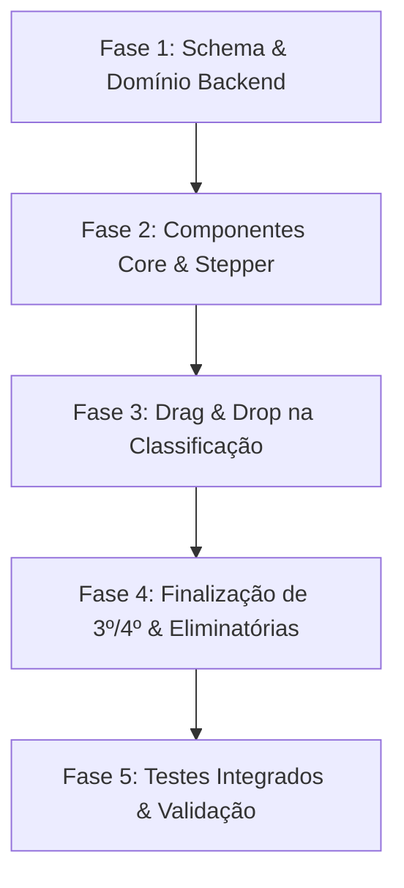

# Plano de Implementação: Interface Drag-and-Drop, Gestão de Ranking e UX de Torneios

> **Arquivo:** `ranking-dnd-ux.md`  
> **Status:** Planejamento Aprovado para Execução  
> **Referências Obrigatórias:** `docs/UX_UI_DESIGN_SYSTEM.md` e `docs/PRD.md`  
> **Arquitetura Alvo:** Next.js 16 (App Router) + React 19 + Supabase + Tailwind CSS v4  

---

## 1. Visão Geral e Objetivos de Longo Prazo

Este projeto visa modernizar e blindar a experiência de operação e visualização dos torneios de Beach Tennis da **Liga Jurerê Beach Sports**, substituindo fluxos manuais rígidos por uma experiência visual moderna ("WOW"), ágil e à prova de falhas humanas na beira da quadra.

### Metas Principais:
1. **Diferenciação Justa de Pódio (3º e 4º Lugares)**: Estruturar pontuação dedicada para 3º e 4º colocados com suporte a disputa em quadra ou fallback automático por mérito técnico (evitando W.O.s e paralisias).
2. **Interface "WOW" com Drag-and-Drop (Dnd)**: Permitir que o organizador monte as duplas do mata-mata arrastando atletas diretamente para os slots e resolva empates matemáticos com reordenação fluida e magnética.
3. **Triagem e Blindagem dos Eliminados**: Isolar os atletas que não passaram da fase de grupos, garantindo que não poluam a área de trabalho das eliminatórias nem sejam inseridos por engano nas chaves.
4. **Eliminação de Estados de "Limbo" na UI**: Guiar o organizador através de um *Stepper* de etapas persistente e *Floating Action Bars* acionadas assim que uma fase é concluída.
5. **Identidade Visual e Avatares Leves**: Implementar avatares determinísticos com iniciais e gradientes (peso zero) com upload opcional de fotos comprimidas no navegador via Canvas/WebP (< 15 KB).

---

## 2. Decisões Arquiteturais e Modelo de Dados

### 2.1 Evolução do Schema Supabase (`supabase/schema.sql` e Migração)
```sql
-- 1. Tabela de configuração de pontos da liga
ALTER TABLE league_ranking_points_config 
  ADD COLUMN IF NOT EXISTS pts_terceiro INTEGER NOT NULL DEFAULT 95,
  ADD COLUMN IF NOT EXISTS pts_quarto INTEGER NOT NULL DEFAULT 80;

-- 2. Tabela de pontos calculados dos jogadores
ALTER TABLE tournament_player_points 
  ADD COLUMN IF NOT EXISTS knockout_position INTEGER DEFAULT NULL;

-- 3. Fotos de perfil para atletas
ALTER TABLE players 
  ADD COLUMN IF NOT EXISTS avatar_url TEXT DEFAULT NULL;

-- 4. Suporte a overrides de ranking geral
ALTER TABLE tournaments
  ADD COLUMN IF NOT EXISTS general_order_overrides JSONB DEFAULT '{}'::jsonb;
```

### 2.2 Evolução dos Módulos de Domínio (`lib/domain/`)
- `lib/domain/ranking.ts`:
  - Atualizar `PointsConfig`: incluir `pts_terceiro: number` e `pts_quarto: number`.
  - Atualizar `KnockoutResult`: `"none" | "quartas" | "semis" | "terceiro" | "quarto" | "vice" | "campeao"`.
  - Atualizar `computePlayerPoints` para pontuar com base no pódio completo.
- `lib/domain/bracket.ts`:
  - Função auxiliar `resolvePodium(matches, overallStandings)`: detecta o resultado da partida de 3º lugar. Caso não tenha ocorrido (cancelada/não disputada), calcula o 3º e 4º colocados pelo desempate técnico (saldo de games das semis ou melhor campanha na fase de grupos).
- `lib/domain/standings.ts`:
  - Suporte a reordenação manual assistida para desempates no ranking geral (`computeOverallStandingsWithOverrides`).

---

## 3. Detalhamento dos Pilares de Implementação

### Pilar 1: Pontuação de 3º e 4º Lugares com Fallback Técnico
- **Regra de Negócio**:
  - Se a partida de `terceiro` lugar for disputada com placar salvo:
    - Dupla vencedora → `terceiro` (`pts_terceiro`, padrão 95 pts).
    - Dupla derrotada → `quarto` (`pts_quarto`, padrão 80 pts).
  - Se a partida **não for disputada** (ex: atletas exaustos ao fim do dia):
    - O organizador pode marcar o confronto como "Classificar por critério técnico".
    - O algoritmo desempata automaticamente: 1º Saldo de games no torneio; 2º Vitórias na fase de grupos; 3º Ordem alfabética.
- **Configuração da Liga**:
  - A tela `/configuracoes` ganha os inputs de `3º Lugar` e `4º Lugar` com validação de hierarquia (`Campeão > Vice > 3º > 4º > Quartas`).

---

### Pilar 2: Interface "WOW" com Drag-and-Drop em `/classificacao`
- **Biblioteca / Engine**:
  - Utilização do `@dnd-kit/core` e `@dnd-kit/sortable` (100% compatível com React 19 e Next.js 16, leve, com excelente suporte tátil em celulares).
- **Design & Interação**:
  - **Grid de Classificados**: Cada atleta é representado por um card tátil com avatar, nome, grupo original e estatísticas resumidas (V: 3 | Saldo: +8).
  - **Zonas de Soltura (Drop Zones)**: Slots das duplas organizados em cards elegantes com o número da dupla e a semente (`Seed #1`, `Seed #2`...).
  - **Feedback Visual Magnético**:
    - Ao arrastar um atleta sobre uma dupla, o slot alvo acende com borda destacada na cor da marca (`#4ABACC`) e fundo suave (`#E8F8FB`).
    - Animações fluidas de troca de posição e micro-vibração/feedback tátil quando solto.
  - **Resolução Interativa de Empates**:
    - Quando o sistema detecta empate matemático nos critérios oficiais (Pts, Saldo e G+), um badge chamativo de alerta surge ao lado dos atletas: `Empate Técnico`.
    - O admin pode simplesmente arrastar o atleta na lista para cima ou para baixo para definir o desempate, e as duplas recalculam instantaneamente.
  - **Garantia de Acessibilidade e Fallback**:
    - Botão de ação rápida secundário (setas ⬆️ / ⬇️ e menu de troca rápida) para uso em condições extremas de tela molhada ou sol excessivo.

---

### Pilar 3: Triagem e Blindagem de Atletas Eliminados
- **Segmentação Visual**:
  - A tela de classificação adota Abas Superiores estilizadas conforme o Design System:
    - `[ Classificados para Eliminatórias (16) ]` (Aba ativa por padrão)
    - `[ Fase de Grupos Concluída / Eliminados (8) ]` (Aba secundária para consulta)
- **Blindagem de Integridade**:
  - Atletas eliminados **não aparecem** nas zonas de arraste de duplas.
  - Se o número de classificados por grupo for alterado no seletor (ex: de 3 para 2), a linha de corte e as abas reagem em tempo real, atualizando a quantidade de duplas possíveis (2, 4, 6 ou 8).

---

### Pilar 4: Prevenção de Estados de Limbo & Orquestração de Fases
- **Componente `TournamentProgressStepper`**:
  - Fixo no topo do layout do torneio (`app/torneios/[id]/layout.tsx`):
    `1. Rascunho` ➔ `2. Grupos` ➔ `3. Classificação` ➔ `4. Eliminatórias` ➔ `5. Finalizado`.
  - Etapas concluídas ganham check verde (`#10B981`); etapa ativa recebe destaque da marca (`#4ABACC`).
- **Barra de Ação Flutuante (`FloatingActionBar`)**:
  - Quando a fase de grupos atinge 100% dos jogos com status `concluido`:
    - Fixa-se uma barra inferior com animação de subida suave (`tw-animate-css`):
      `🟢 Todos os jogos de grupo concluídos! [Avançar para Formação de Duplas ➔]` (Altura 48px, botão com contraste total).
- **Status Transparente na Tela Pública (`/visualizacao`)**:
  - Quando o torneio está na transição entre grupos e mata-mata, os espectadores veem um banner informativo:  
    *"Fase de grupos finalizada! A organização está definindo as duplas do mata-mata."*

---

### Pilar 5: Sistema Híbrido de Avatares & Fotos de Perfil
- **Componente `PlayerAvatar`**:
  - Propriedades: `name: string`, `avatarUrl?: string | null`, `size?: "sm" | "md" | "lg"`.
  - **Modo Padrão (Zero Storage / Instantâneo)**:
    - Iniciais maiúsculas do atleta (ex: "RM" para Ricardo Miranda).
    - Fundo com gradiente sutil gerado a partir de um hash do nome do atleta, garantindo consistência visual.
  - **Upload e Otimização Client-Side (WebP Canvas)**:
    - Integrado ao `EditPlayerDialog`.
    - Ao selecionar uma imagem, o navegador usa a Canvas API para recortar centralizado, redimensionar para 120x120px e comprimir em WebP (qualidade 0.8).
    - Arquivo resultante: **< 15 KB**.
    - Salvo no bucket público `player-avatars` do Supabase Storage.

---

## 4. Conformidade Estrita com `UX_UI_DESIGN_SYSTEM.md`

| Item do Design System | Diretriz Canônica | Aplicação no Projeto |
| :--- | :--- | :--- |
| **Cores Primárias** | Brand `#4ABACC`, Hover `#389EAF`, Light `#E8F8FB` | Slots de drag-and-drop ativos, stepper, botões de avanço. |
| **Alvos de Toque (Touch Targets)** | Mínimo de 44px de área clicável | Drag handles, botões de reordenação e cards arrastáveis com `min-h-[48px]`. |
| **Tipografia & Legibilidade** | Inter (sans-serif) e Geist Mono para números | Nomes de atletas legíveis com alto contraste sob luz solar; placares e seeds monoespaçados. |
| **Feedback de Sucesso/Alerta** | Sonner toasts e alertas contextuais | Toasts em ações de salvar e banners avisando empates e conclusões de fase. |
| **Cores de Grupos** | `group-1` até `group-8` | Badges de identificação de qual grupo o atleta veio na tela de classificação. |

---

## 5. Fases de Execução e Responsabilidades



### Fase 1: Camada de Dados e Domínio Matemático
- **Agentes**: `@database-design` / `@backend-specialist`
- Atualizar `schema.sql` com colunas de 3º/4º lugares e `avatar_url`.
- Refatorar `lib/domain/ranking.ts` com nova tipagem e testes unitários.
- Implementar algoritmo de fallback técnico para disputa de 3º lugar em `lib/domain/bracket.ts`.
- **Verificação**: `npm test` aprovando toda a suíte de Vitest.

### Fase 2: Stepper Global e Componentes de Feedback
- **Agentes**: `@frontend-specialist` / `@design-spec`
- Criar `TournamentStepper` e integrá-lo ao layout de torneios.
- Criar `FloatingActionBar` para transições de fase automatizadas.
- Criar `PlayerAvatar` com iniciais e gradiente determinístico.
- Atualizar `EditPlayerDialog` com upload e compressão Canvas WebP.

### Fase 3: Tabuleiro Interativo Drag-and-Drop (`/classificacao`)
- **Agentes**: `@frontend-specialist` / `@nextjs-react-expert`
- Instalar e configurar `@dnd-kit/core` e `@dnd-kit/sortable`.
- Construir os cards de jogadores arrastáveis com touch-action otimizada para mobile.
- Construir os slots de duplas com animação de entrada e soltura magnética.
- Implementar abas separando Classificados e Eliminados.
- Implementar detecção visual de empates e reordenação instantânea.

### Fase 4: Chaveamento Eliminatório e Apuração do Pódio
- **Agentes**: `@frontend-specialist` / `@orchestrator`
- Atualizar tela `/torneios/[id]/eliminatorias`:
  - Exibir opção "Declarar sem disputa (Desempate técnico)" no card de 3º lugar.
  - Atualizar rotina de finalização do torneio para gravar `pts_terceiro` e `pts_quarto`.
- Atualizar tela de configurações da liga (`/configuracoes`) com os novos campos de pontuação.

### Fase 5: Validação Rigorosa, A11y e Testes Manuais
- **Agentes**: `@verify-changes` / `@lint-and-validate`
- Executar suíte de testes Vitest (`lib/domain/__tests__`).
- Validar layout mobile em viewport de smartphone (touch drag & drop).
- Executar `npm run lint` e `npx tsc --noEmit` garantindo zero erros.

---

## 6. Plano de Rollback e Segurança

- Se houver necessidade de reverter alterações de banco: as novas colunas possuem valores `DEFAULT` que mantêm retrocompatibilidade com torneios já finalizados.
- Se o usuário estiver em um dispositivo móvel legado incompatível com touch drag-and-drop: botões de clique rápido (setas e seleção em lista) permanecem disponíveis como fallback universal.
